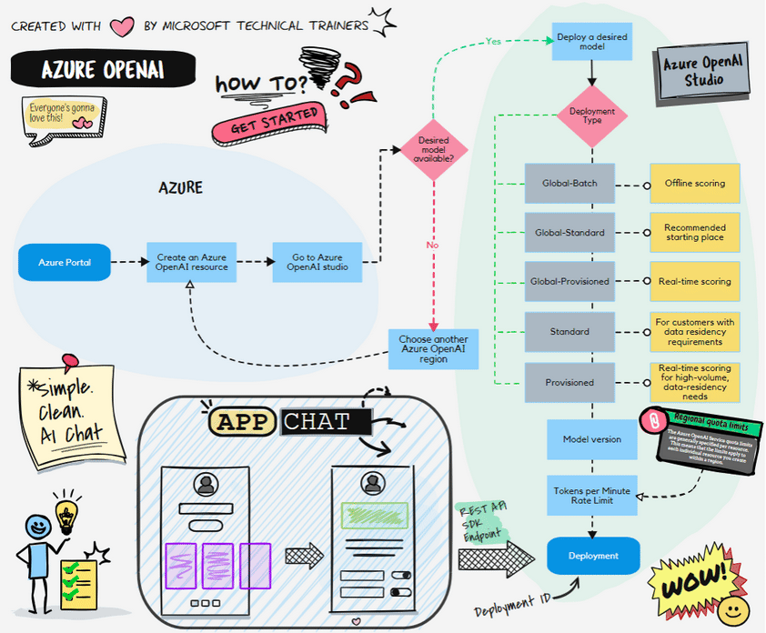

# Azure Animations

||
|:---:|
| Created with :heart: by Microsoft Technical Trainers|

## About

At Azure Animations, we believe that understanding complex cloud technologies doesn't have to be difficult or boring. That's why we've reimagined learning with a fresh approach—by turning intricate concepts into engaging, fun Animations. Our platform brings the worlds of Devevlopers 💻, DevSecOps - Security 🔐, Cloud ☁️, and AI 🤖 to life, making it easier for everyone, from beginners to experts, to grasp essential ideas and stay up-to-date with the latest in technology.

Our Animations are crafted by Microsoft Technical Trainers 👨‍🏫👩‍🏫 , ensuring that the content is not only accurate but also creatively presented to hold your attention. Whether you're looking to demystify cloud architecture, explore security best practices, or dive into AI innovations, Azure Animations is here to help you visualize and understand the most important concepts in the tech world.

Get ready to learn, engage, and have fun with Azure Animations where cloud technology comes to life! 🚀

Don't forget to star (🌟) this repo to find it easier later.

# Content

## 🤖 AI 

Azure AI is your gateway to transforming ideas into reality! Whether it's building intelligent apps, automating processes, or gaining insights from your data, Azure's cutting-edge AI services are here to supercharge your innovation 🚀. With powerful tools like Azure Cognitive Services, Machine Learning, and AI-powered analytics, the future is in your hands. Ready to turn your data into smart solutions? Let's redefine what's possible with AI in Azure! 💡✨

### Azure OpenAI - Provisioning and Deployment Creation

  
  

    Azure OpenAI - Provisioning and Deployment Creation <a href="https://aka.ms/AzureAnimations/AzureOpenAI/ProvisionDeploymentCreation">Click to download in HD size</a>
  

Above illustrates the process of provisioning Azure OpenAI, we start by using the Azure Portal. First, navigate to the Azure OpenAI Studio where you can select the appropriate model for your needs, such as GPT-4, GPT-4o, etc. Before users can consume the model, they need to select the model and create a deployment. There are several types of deployments available:

1. Azure Portal: Start by using the Azure Portal to navigate to Azure OpenAI Studio.
2. Select Model: Choose the right model (e.g., GPT-4, GPT-4o) 🧠.
3. Create Deployment:
   - Global-Batch: For offline scoring 🕒.
   - Global-Standard: Recommended starting point 🌍.
   - Global-Provisioned: For real-time scoring with high volume 📈.
   - Standard: General-purpose deployment.
   - Provisioned: For high-volume workloads.
4. Deploy: Once deployed, the application calls the Azure OpenAI endpoint using the deployment ID 🔗, using the SDK REST API.

## 💻☁️ Compute Options 

Azure offers a world of compute options designed to power anything from your small apps to global-scale services. With virtual machines for full control, serverless computing with Azure Functions, and containers through Kubernetes, you're equipped to build and scale faster than ever ⚡. Whether you're optimizing performance or reducing costs, Azure's flexible compute solutions have got you covered—ready to take your projects to the next level? Let Azure Compute lead the way! 🌟

### App Service Animations Overview

Above illustrates the process of using Azure App Service. We start by provisioning the App Service and App Service Plan. Here’s a step-by-step breakdown:

1. **🚀 App Service & App Service Plan**
   - **App Service**: A fully managed platform for building, deploying, and scaling web apps.
   - **App Service Plan**: Defines the region, number of instances, and pricing tier for your App Service.

2. **📈 Autoscaling**
   - **Autoscaling**: Automatically adjusts the number of instances based on demand to ensure optimal performance and cost-efficiency.

3. **🔄 Continuous Deployment**
   - **Continuous Deployment**: Seamlessly deploy updates from your favorite source control systems:
     - **Git**: Version control system for tracking changes.
     - **GitHub**: Hosting service for Git repositories.
     - **Azure DevOps**: Comprehensive suite for DevOps practices.
     - **Bitbucket**: Git repository management solution.

4. **🔐 Authentication**
   - **Built-in Authentication**: Easily enable authentication using:
     - **Microsoft Account**: Secure login with Microsoft credentials.
     - **Facebook**: Social login with Facebook.
     - **Apple Account**: Secure login with Apple ID.
     - **And more**: Support for various other identity providers.

5. **🛡️ Security**
   - **TLS/SSL**: Ensure secure communication with Transport Layer Security (TLS) and Secure Sockets Layer (SSL) certificates.

6. **🚀 Deployment Slots**
   - **Deployment Slots**: Create staging environments to test new versions before going live. Easily promote new versions with zero downtime.

7. **🌐 Traffic Manager**
   - **Traffic Manager**: Distribute traffic across multiple instances and regions. Specify the percentage of traffic for each instance to manage load effectively.

## 📦 Storage Options

Azure provides a variety of storage solutions to meet the diverse needs of modern applications. These options are designed to handle different types of data, access patterns, and performance requirements.

### Storage Account

Above illustrates the process of using an Azure Storage Account. We start by understanding the pricing tiers and the various services it offers. Here’s a step-by-step breakdown:

1. Pricing Tier: Choose the appropriate pricing tier based on your needs. Azure Storage offers different tiers to optimize cost and performance 💰.
2. Services: Azure Storage provides several services to store different types of data:
   - Blob Storage: For storing large amounts of unstructured data 📦.
   - File Storage: Managed file shares for cloud or on-premises deployments 📁.
   - Table Storage: NoSQL key-value store for rapid development 📋.
   - Queue Storage: Messaging queue for communication between application components 📬.
3. Blob Types: Understand the different types of blobs available:
   - Block Blobs: For storing text and binary data 📝.
   - Append Blobs: Optimized for append operations, such as logging 📜.
   - Page Blobs: For random read/write operations, often used for virtual hard disks 💾.
4. Access Tiers: Select the appropriate access tier based on how frequently you need to access the data:
   - Hot: For data that is accessed frequently 🔥.
   - Cool: For data that is infrequently accessed and stored for at least 30 days ❄️.
   - Cold: For data that is infrequently accessed and stored for at least 90 days 🧊.
   - Archive: For data that is rarely accessed and stored for at least 180 days 🗄️.

> **Penalties**: Be aware of the penalties associated with moving data between access tiers. For example, moving data from the Archive tier to the Hot tier may incur additional costs ⚠️.

# Help Wanted 📒

Do you have suggestions for Azure Animations? Want to submit an idea or found spelling or code errors? Raise an issue or create a pull request.

# Special Thanks ❤️

* **🎨 Animations Artists:** [Saki Homma](https://www.linkedin.com/in/sakkuru/), [Kristen Chan](https://www.linkedin.com/in/kristen-chan/), [Masato Kikukawa](https://www.linkedin.com/in/kikukawa9/)
* **✍️ Sketch illustrator:** [Payal Guruprasad](https://www.linkedin.com/in/payalguruprasad/)
* **🎞️ Broadcasters:** [Joel Ganesan](https://www.linkedin.com/in/joelji/), [Vincent Kok](https://www.linkedin.com/in/vincekok/), [Neeraj Kumar](https://www.linkedin.com/in/neerajtrainer/)
* **🙏 Core Contributors:** [Nuttapong .](https://www.linkedin.com/in/nutwongaree/)
