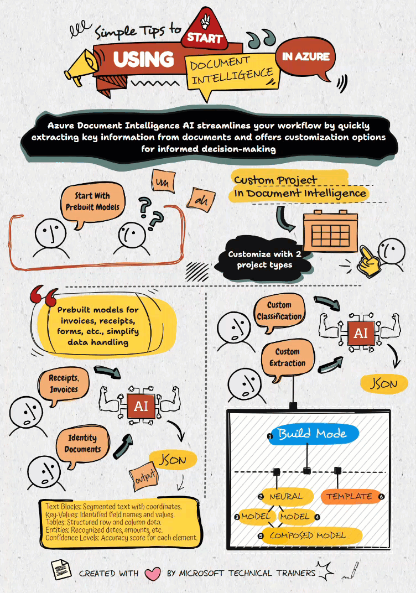
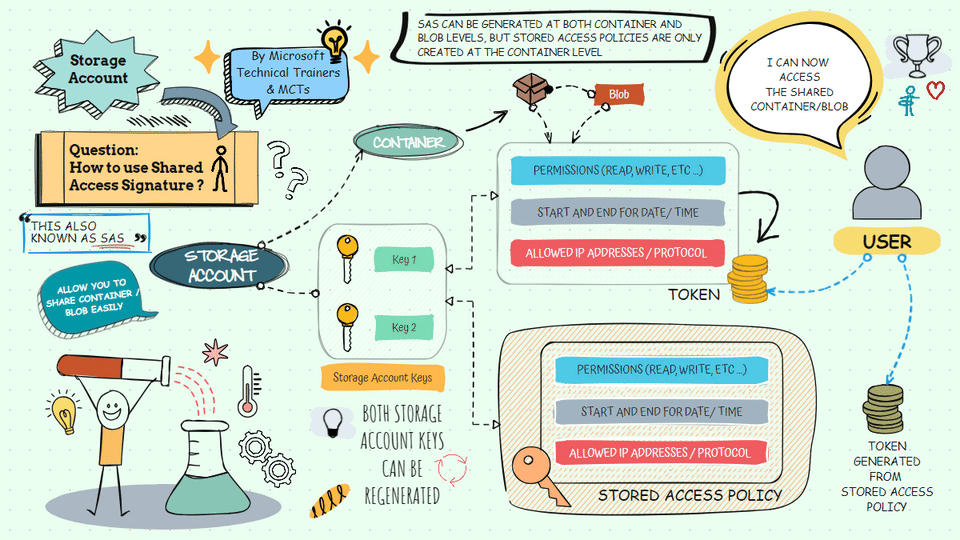
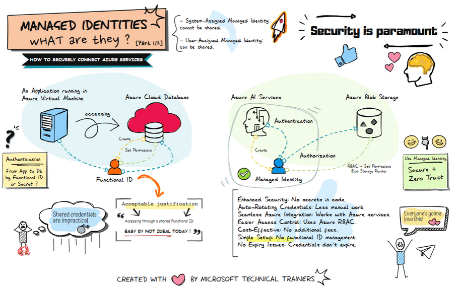

# Azure Animations

||
|:---:|
| Created with :heart: by Microsoft Technical Trainers & MCTs|

## About

At Azure Animations, we believe that understanding complex cloud technologies doesn't have to be difficult or boring. That's why we've reimagined learning with a fresh approach—by turning intricate concepts into engaging, fun Animations. Our platform brings the worlds of Developers 💻, DevSecOps - Security 🔐, Cloud ☁️, and AI 🤖 to life, making it easier for everyone, from beginners to experts, to grasp essential ideas and stay up-to-date with the latest in technology.

Our Animations are crafted by Microsoft Technical Trainers & MCTs 👨‍🏫👩‍🏫 , ensuring that the content is not only accurate but also creatively presented to hold your attention. Whether you're looking to demystify cloud architecture, explore security best practices, or dive into AI innovations, Azure Animations is here to help you visualize and understand the most important concepts in the tech world.

Get ready to learn, engage, and have fun with Azure Animations where cloud technology comes to life! 🚀

Don't forget to star (🌟) this repo to find it easier later.

# Content

## 1️⃣ AI 

Azure AI is your gateway to transforming ideas into reality! Whether it's building intelligent apps, automating processes, or gaining insights from your data, Azure's cutting-edge AI services are here to supercharge your innovation 🚀. With powerful tools like Azure Cognitive Services, Machine Learning, and AI-powered analytics, the future is in your hands. Ready to turn your data into smart solutions? Let's redefine what's possible with AI in Azure! 💡✨

### 🔸Get started : AI in Azure

  
  

    <a href="javascript:void(0);" onClick="window.open('https://azureanimations.github.io/player/animationPlayer.html?vdo=https://azureanimations.github.io/images/animations-high-resolutions/AI/Get-Started-AI-In-Azure-Vdo.mp4&animationTitle=Get%20Started%20AI%20in%20Azure&pauseTimes=4.23,5.5,7,8.45,9.95,11.45,12.65,14.2', '_blank')" style="display:inline-block;padding:10px 20px;font-size:16px;color:white;background-color:#007bff;border:none;border-radius:5px;text-decoration:none;cursor:pointer;">🎬 Present Animation</a>
 <a href="https://raw.githubusercontent.com/AzureAnimations/AzureAnimations.github.io/main/images/animations-high-resolutions/AI/Get-Started-AI-In-Azure.png" target="_blank">Click to download in HD size</a>, <a href="https://raw.githubusercontent.com/AzureAnimations/AzureAnimations.github.io/main/images/animations-high-resolutions/AI/Get-Started-AI-In-Azure.gif" target="_blank">GIF</a> or <a href="https://raw.githubusercontent.com/AzureAnimations/AzureAnimations.github.io/main/images/animations-high-resolutions/AI/Get-Started-AI-In-Azure-Vdo.mp4" target="_blank">view the HD video</a>
  

AI in Azure offers a range of cloud services designed to help you build intelligent applications. Here's how to get started:

1. **Navigate to the Azure Portal**: Log in to manage your Azure services.
2. **Choose Cognitive Services or Generative AI**: Select the AI service that fits your needs, like Computer Vision or Speech.
3. **Provision AI services**: Set up your AI service by choosing the pricing tier, region, networking options, and managed identities.
4. **Integrate AI into your applications**: Add AI capabilities to your apps, such as image recognition or natural language processing.
5. **Connect using managed identities, keys, or endpoints**: Securely connect to your AI services.
6. **Use REST APIs**: Send HTTP requests and receive responses from the AI services.
7. **Use SDKs**: Alternatively, use SDKs in languages like C#, Java, Python, and NodeJS.
8. **Consume and pay per use**: Use the AI services as needed and pay based on your usage.

### 🔸REST API and SDK

  
  

    REST API and SDK <a href="https://raw.githubusercontent.com/AzureAnimations/AzureAnimations.github.io/main/images/animations-high-resolutions/AI/rest_sdk.gif" target="_blank">Click to download in HD size</a>
  

**What is REST?**
REST (Representational State Transfer) is an architectural style used for designing networked applications. It relies on HTTP requests to communicate between clients and servers.

**Key Concepts of REST:**
- **HTTPS**: Secure communication protocol.
- **Request**: A call made to the server.
- **Response**: The data returned by the server.
- **JSON**: A lightweight data format used for exchanging information.
- **Key**: Authentication method for API access.

**Understanding SDK and REST API Usage**
Azure provides different ways to integrate AI and cloud services into applications:

**1️⃣ SDK Supported Languages**
- **Languages:** C#, Python, and others.
- **SDK Usage:**
  - Developers can use pre-built SDKs, which simplify the process of making API calls.
  - SDKs handle HTTP requests and responses internally, allowing developers to interact with services using concise, high-level code.
- **Example Services:**
  - AI Search
  - Azure OpenAI

**2️⃣ Non-Supported SDK Languages**
- **Languages:** Dart, Swift, and others.
- **Manual Implementation:**
  - Developers must send HTTPS requests manually, handling request formatting, authentication, and response parsing.
- **Example Services:**
  - Computer Vision
  - Translator

<h2>Choosing the Right Approach</h2>
<table>
  <tr>
    <th>Feature</th>
    <th>SDK Supported Languages</th>
    <th>Non-Supported SDK Languages</th>
  </tr>
  <tr>
    <td>Ease of Use</td>
    <td>✅ Simplified API calls</td>
    <td>⚠️ Manual request handling</td>
  </tr>
  <tr>
    <td>Performance</td>
    <td>✅ Optimized for efficiency</td>
    <td>⚠️ Requires more development effort</td>
  </tr>
  <tr>
    <td>Flexibility</td>
    <td>✅ SDK handles authentication & requests</td>
    <td>✅ Full control over API implementation</td>
  </tr>
</table>

**Conclusion**
When working with Azure services, choosing **SDK-supported languages** can significantly reduce development time. However, for languages that lack SDK support, developers can still use REST APIs by manually implementing HTTP requests and responses.

### 🔸Understanding Azure AI: Single Service vs. Multi-Service Account

  
  

    <a href="javascript:void(0);" onClick="window.open('https://azureanimations.github.io/player/animationPlayer.html?vdo=https://azureanimations.github.io/images/animations-high-resolutions/AI/AI-Single-vs-Multi-Service-Vdo.mp4&animationTitle=Understanding%20Azure%20AI%3A%20Single%20Service%20vs.%20Multi-Service%20Account&pauseTimes=6.55,17.3,30.7', '_blank')" style="display:inline-block;padding:10px 20px;font-size:16px;color:white;background-color:#007bff;border:none;border-radius:5px;text-decoration:none;cursor:pointer;">🎬 Present Animation</a>
 <a href="https://raw.githubusercontent.com/AzureAnimations/AzureAnimations.github.io/main/images/animations-high-resolutions/AI/AI-Single-vs-Multi-Service.gif" target="_blank">Click to download in HD size</a> or <a href="https://raw.githubusercontent.com/AzureAnimations/AzureAnimations.github.io/main/images/animations-high-resolutions/AI/AI-Single-vs-Multi-Service-Vdo.mp4" target="_blank">view the HD video</a>
  

**Azure AI Single Service Account**
- **Purpose**: Designed for accessing a single Azure AI service.
- **Credentials**: Each service has its own unique set of credentials (keys and endpoints).
- **Use Case**: Ideal for projects that require only one specific AI capability, such as Face API or Text Analytics.
- **Example**: If you need to use only the Computer Vision service for image analysis, a Single Service account is the right choice.

**Azure AI Multi-Service Account**
- **Purpose**: Allows access to multiple Azure AI services with a single set of credentials.
- **Credentials**: One set of credentials works for all the services under this account.
- **Use Case**: Perfect for projects that need several AI capabilities, simplifying management and integration.
- **Example**: If your project requires both Text Analytics and Speech services, a Multi-Service account provides a streamlined solution.

**Key Takeaways**
- **Single Service Account**:
  - 🎯 Focused on one AI service.
  - 🔑 Separate credentials for each service.
  - 🛠️ Best for specific, single-service needs.

- **Multi-Service Account**:
  - 🌐 Access multiple AI services with one account.
  - 🔒 Simplifies credential management.
  - 🚀 Ideal for complex projects needing multiple AI capabilities.

**Summary**
- **Single Service**: One service, one key.
- **Multi-Service**: One account access all.

### 🔸Azure AI Containers

  
  

    <a href="javascript:void(0);" onClick="window.open('https://azureanimations.github.io/player/animationPlayer.html?vdo=https://azureanimations.github.io/images/animations-high-resolutions/AI/Cognitive-Container-Vdo.mp4&animationTitle=Azure%20AI%20Containers&pauseTimes=7.6,15.4,23.18,27.8,43.457', '_blank')" style="display:inline-block;padding:10px 20px;font-size:16px;color:white;background-color:#007bff;border:none;border-radius:5px;text-decoration:none;cursor:pointer;">🎬 Present Animation</a> <a href="https://raw.githubusercontent.com/AzureAnimations/AzureAnimations.github.io/main/images/animations-high-resolutions/AI/Cognitive-Container.gif" target="_blank">Click to download in HD size</a> or <a href="https://raw.githubusercontent.com/AzureAnimations/AzureAnimations.github.io/main/images/animations-high-resolutions/AI/Cognitive-Container-Vdo.mp4" target="_blank">view the HD video</a>
  

🚀 Embrace On-Premises AI with Azure: Dive into the world of on-site artificial intelligence with Azure AI containers. Our guide outlines the steps to integrate Azure's powerful AI features into your own infrastructure, ensuring control and customization.

Key Benefits and Steps:

1. 🧩 Seamless Integration: Deploy Azure's Docker containers on-premises to bring a myriad of AI services into your applications, enhancing them with capabilities like language processing and image recognition.
2. 🔒 Data Privacy & Speed: Maintain the confidentiality of your data and enjoy the benefits of quick processing by running AI services locally.
3. 🛠️ Customized AI Solutions: Tailor AI to fit your business needs with these capabilities:
   - 📝 Language Processing: Equip your apps with sophisticated text analysis and language comprehension.
   - 🗣️ Speech Recognition: Convert speech to text for voice-driven interactions.
   - 👁️ Vision Analytics: Analyze visual information for insights and automation.
   - 💡 Decision Intelligence: Build applications that make smart decisions.
4. 🔐 Secure Communication: Adjust your firewall settings to safely connect with Azure endpoints, ensuring secure operations and precise billing.
5. 💸 Flexible Pricing Options: Select the best pricing model for your needs:
   - 💳 Pay-As-You-Go: Ideal for variable workloads, pay only for what you consume.
   - 📦 Commitment Plans: Enjoy reduced rates with a set usage agreement.
   - 🌐 Disconnected Mode: Use AI services offline at a discounted rate.
6. 🏁 Getting Started: Initiate your AI journey with three essential elements:
   - 🔑 API Key: Obtain the API key for Azure AI services.
   - 💳 Billing Endpoint: Set up your billing endpoint for resource management.
   - ✅ EULA: Accept the End User License Agreement to proceed.

Azure AI containers provide an optimal blend of performance, privacy, and cost-effectiveness. Integrate these AI services into your on-premises setup and elevate your business operations today.

### 🔸Azure OpenAI - Provisioning and Deployment Creation

  
  

    <a href="javascript:void(0);" onClick="window.open('https://azureanimations.github.io/player/animationPlayer.html?vdo=https://azureanimations.github.io/images/animations-high-resolutions/AI/Azure%20OpenAI%20-%20AI%20Foundry%20Provisioning%20and%20Deployment%20Creation.mp4&animationTitle=Azure%20OpenAI%20-%20Provisioning%20and%20Deployment%20Creation&pauseTimes=23.7,32,63.9,68', '_blank')" style="display:inline-block;padding:10px 20px;font-size:16px;color:white;background-color:#007bff;border:none;border-radius:5px;text-decoration:none;cursor:pointer;">🎬 Present Animation</a> <a href="https://raw.githubusercontent.com/AzureAnimations/AzureAnimations.github.io/main/images/animations-high-resolutions/AI/Azure%20OpenAI%20-%20AI%20Foundry%20Provisioning%20and%20Deployment%20Creation.gif" target="_blank">Click to download in HD size</a>, <a href="https://raw.githubusercontent.com/AzureAnimations/AzureAnimations.github.io/main/images/animations-high-resolutions/AI/Azure%20OpenAI%20-%20AI%20Foundry%20Provisioning%20and%20Deployment%20Creation.mp4" target="_blank">view the HD video</a>, <a href="https://raw.githubusercontent.com/AzureAnimations/AzureAnimations.github.io/main/presentations/AI/Azure%20OpenAI%20-%20AI%20Foundry%20Provisioning%20and%20Deployment%20Creation.pptx" target="_blank">Presentation slide (pptx)</a>
  

Above illustrates the process of provisioning Azure OpenAI, we start by using the Azure Portal. First, navigate to the Azure AI Foundry where you can select the appropriate model for your needs, such as GPT-4, GPT-4o, etc. Before users can consume the model, they need to select the model and create a deployment. There are several types of deployments available:

1. Azure Portal: Start by using the Azure Portal to navigate to Azure AI Foundry.
2. Select Model: Choose the right model (e.g., GPT-4, GPT-4o) 🧠.
3. Create Deployment:
   - Global-Batch: For offline scoring 🕒.
   - Global-Standard: Recommended starting point 🌍.
   - Global-Provisioned: For real-time scoring with high volume 📈.
   - Standard: General-purpose deployment.
   - Provisioned: For high-volume workloads.
   - Data Zone Standard: Leverages Azure global infrastructure for best availability and higher default quotas.
   - Data Zone Provisioned: Global infrastructure, best availability, reserved capacity for high and predictable throughput.
4. Deploy: Once deployed, the application calls the Azure OpenAI endpoint using the deployment ID 🔗, using the SDK REST API.

> Click the video below for recorded explanations by [Vincent Kok](https://www.linkedin.com/in/vincekok/).
>  
> 

### 🔸Azure AI Search - Custom Skill

  
  

    Azure AI Search - Custom Skill <a href="https://raw.githubusercontent.com/AzureAnimations/AzureAnimations.github.io/main/images/animations-high-resolutions/AI/AzureAISearch-CustomSkill.gif" target="_blank">Click to download in HD size</a> or <a href="https://raw.githubusercontent.com/AzureAnimations/AzureAnimations.github.io/main/images/animations-high-resolutions/AI/AzureAISearch-CustomSkill-Vdo.mp4" target="_blank">view the HD video</a>
  

Azure AI Search empowers us to create custom search engines and enhances document discoverability using AI-powered capabilities. By leveraging built-in AI skills, Azure AI Search enables efficient information extraction, while also allowing you to integrate custom skills for tailored solutions.This guide provides a comprehensive overview of the Azure AI Search architecture and a step-by-step walkthrough for implementation. As a practical example, it demonstrates how to set up a search solution for invoice documents.

1. **🚀 Upload the invoices to Azure Blob Storage** : Store the invoice files in Azure Blob Storage as the source data.
2. **📋 Document Cracking** : Use Azure AI Search's document-cracking feature to extract the content and structure from the files in Blob Storage.
3. **⛏️ Extract information using Custom Skills** : Configure a skillset with Azure Function, which will call Azure AI Document Intelligence to extract key information from invoices, such as the invoice ID and customer address.
4. **📝 Document Enrichment** : The skillset enriches the extracted data, producing structured outputs, such as invoice IDs and customer addresses.
5. **👁️ Index Creation** : Create the index field (e.g., invoice IDs and customer addresses)
6. **🔥 Search Usage** : Users can search for documents in Azure AI Search by providing inputs such as the customer address or invoice ID to quickly locate the relevant invoices.

Azure AI Search is a powerful AI-driven solution that combines built-in and custom AI capabilities to make document content easily searchable and accessible, enabling efficient information retrieval and application.

> Click the video below for recorded explanations by [Vincent Kok](https://www.linkedin.com/in/vincekok/).
>  
> 

### 🔸Azure AI Document Intelligence

  
  

    <a href="javascript:void(0);" onClick="window.open('https://azureanimations.github.io/player/animationPlayer.html?vdo=https://azureanimations.github.io/images/animations-high-resolutions/AI/Document-Intelligence-Vdo.mp4&animationTitle=Azure%20AI%20Document%20Intelligence&pauseTimes=9.5,14.354,37.6', '_blank')" style="display:inline-block;padding:10px 20px;font-size:16px;color:white;background-color:#007bff;border:none;border-radius:5px;text-decoration:none;cursor:pointer;">🎬 Present Animation</a> <a href="https://raw.githubusercontent.com/AzureAnimations/AzureAnimations.github.io/main/images/animations-high-resolutions/AI/Document-Intelligence.gif" target="_blank">Click to download in HD size</a> or <a href="https://raw.githubusercontent.com/AzureAnimations/AzureAnimations.github.io/main/images/animations-high-resolutions/AI/Document-Intelligence-Vdo.mp4" target="_blank">view the HD video</a>
  

Azure AI Document Intelligence is a cutting-edge technology that simplifies how businesses handle their documents. With its advanced features, you can customize the processing of various document types. Here’s a closer look:

📄 **Optical Character Recognition (OCR)**
Azure's OCR technology converts images and handwritten notes into searchable, editable text. It recognizes text in different languages and formats, paving the way for more advanced processing.

📦 **Prebuilt Models**
These ready-to-use models allow for quick data extraction from standard documents like invoices, receipts, and business cards.

🛠️ **Custom Projects**
For specialized needs, Azure offers tools to create tailored solutions:

**Classification:** Use Azure's machine learning to categorize documents, making it easier to organize and find important information.
 - **Custom Extraction:** Extract specific data according to your needs. There are two methods:
 - **Neural Model:** Recommended for its ability to use neural networks to understand and extract data, adapting to different document layouts. This model is highly effective because it can interpret documents with a level of understanding comparable to human cognition, making it robust against variations in document formats.
**Template Model:** Ideal for structured documents, this method uses predefined templates to ensure accurate data extraction.
 - 🔄 **Composed Models**
Combine different custom models into one for processing multiple document types or using various extraction methods.

Azure AI Document Intelligence helps turn your documents into valuable assets, improving decision-making and efficiency. Embrace the Azure ecosystem to fully unlock the potential of your documents with unmatched customization and intelligence.

> Click the video below for recorded explanations by [Laura Núñez Sierra](https://www.linkedin.com/in/lauransi/).
>  
> 

### 🔸Azure AI Speech Service

  
  

    <a href="javascript:void(0);" onClick="window.open('https://azureanimations.github.io/player/animationPlayer.html?vdo=https://azureanimations.github.io/images/animations-high-resolutions/AI/Azure-Speech-Service-Vdo.mp4&animationTitle=Azure%20AI%20Speech%20Service', '_blank')" style="display:inline-block;padding:10px 20px;font-size:16px;color:white;background-color:#007bff;border:none;border-radius:5px;text-decoration:none;cursor:pointer;">🎬 Present Animation</a> <a href="https://raw.githubusercontent.com/AzureAnimations/AzureAnimations.github.io/main/images/animations-high-resolutions/AI/Azure-Speech-Service.gif" target="_blank">Click to download in HD size</a>
  

Azure Speech Service is a cloud-based platform that offers a wide range of speech-related services, including speech recognition, speech synthesis, speech translation, and avatar-based interactions✨

This service enables developers to seamlessly integrate advanced speech functionalities into applications, tools, and devices💡
Additionally, it allows for customization to meet specific needs, such as creating custom speech models and custom avatars🛠️

**Key Features** 🚀
- **Speech Recognition (Speech to Text)** : Convert spoken language into text, supporting both real-time processing and batch processing📜🎙️
- **Speech Synthesis (Text to Speech)** : Transform text into natural human-like speech, enabling seamless and engaging conversations🗣️🔊
- **Speech Translation** : Translate speech into other languages in real-time, breaking down language barriers 🌍🗣️➡️🌎
- **Custom Speech Models** : Train speech recognition models tailored to specific domains and applications, improving accuracy in specialized fields📈🎯
- **Text-to-Speech Avatar** : Create animated video avatars that speak based on text input, enhancing user engagement through visual interaction🎥🤖
- **Custom Text-to-Speech Avatar** : Develop a unique and natural-looking avatar based on recorded video data of selected actors, ideal for brand and product identity🎭✨

### **Azure OpenAI vs. OpenAI API: Key Differences**  

This infographic compares **Azure OpenAI** and the **OpenAI API** across various factors. Below is a summary of each key point:

  
  

    <a href="javascript:void(0);" onClick="window.open('https://azureanimations.github.io/player/animationPlayer.html?vdo=https://azureanimations.github.io/images/animations-high-resolutions/AI/aoai_diff_openai-Vdo.mp4&animationTitle=Azure%20OpenAI%20vs%20OpenAI%20API%20Key%20Differences', '_blank')" style="display:inline-block;padding:10px 20px;font-size:16px;color:white;background-color:#007bff;border:none;border-radius:5px;text-decoration:none;cursor:pointer;">🎬 Present Animation</a> <a href="https://raw.githubusercontent.com/AzureAnimations/AzureAnimations.github.io/main/images/animations-high-resolutions/AI/aoai_diff_openai.gif" target="_blank">Click to download in HD size</a> or <a href="https://raw.githubusercontent.com/AzureAnimations/AzureAnimations.github.io/main/images/animations-high-resolutions/AI/aoai_diff_openai-Vdo.mp4" target="_blank">view the HD video</a>
  

**1️⃣ Infrastructure Differences**  
**2️⃣ Security & Compliance**  
**3️⃣ Service Integrations**  
**4️⃣ Pricing Structure**  
**5️⃣ Accessibility Levels**  
**6️⃣ Usage Scenarios**  
**7️⃣ Support & Documentation**  
**8️⃣ Target Audience**  

**💡 Conclusion**  
**Azure OpenAI** is best for enterprises needing **security, compliance, and deep integrations**, while **OpenAI API** is more accessible for **individuals and startups** seeking quick AI solutions. 🚀

### **🔍 Unlocking Azure AI Search Potential**  

Azure AI Search is a powerful cloud-based search service that enhances traditional search functionalities with **AI integration**. It enables intelligent, efficient, and scalable search experiences by leveraging AI-powered **data processing, indexing, and semantic search capabilities**. Below, we break down the key components and workflow of **Azure AI Search**.  

  
  

    <a href="javascript:void(0);" onClick="window.open('https://azureanimations.github.io/player/animationPlayer.html?vdo=https://azureanimations.github.io/images/animations-high-resolutions/AI/ai_search-Vdo.mp4&animationTitle=Unlocking%20Azure%20AI%20Search%20Potential', '_blank')" style="display:inline-block;padding:10px 20px;font-size:16px;color:white;background-color:#007bff;border:none;border-radius:5px;text-decoration:none;cursor:pointer;">🎬 Present Animation</a> <a href="https://raw.githubusercontent.com/AzureAnimations/AzureAnimations.github.io/main/images/animations-high-resolutions/AI/ai_search.gif" target="_blank">Click to download in HD size</a> or <a href="https://raw.githubusercontent.com/AzureAnimations/AzureAnimations.github.io/main/images/animations-high-resolutions/AI/ai_search-Vdo.mp4" target="_blank">view the HD video</a>
  

**📌 Key Components & Workflow**  

**1️⃣ Connect to Data Source**  
✅ **Benefit**: This allows businesses to unify their data sources, making them accessible and searchable in real-time.  

**2️⃣ Utilize Skill Set**  
✅ **Benefit**: AI-driven enrichment makes the search more **context-aware**, improving accuracy and discoverability.  

**3️⃣ Implement Indexer**  
✅ **Benefit**: Reduces manual data processing efforts while enabling **AI-powered indexing**.  

**4️⃣ Create an Index**  
✅ **Benefit**: AI-driven indexing makes **retrieval faster, more relevant, and scalable**.  

**5️⃣ Perform AI Processing**  
✅ **Benefit**: Search results are **smarter, more intuitive, and personalized** for users.  

**🌟 Conclusion**  
Azure AI Search **revolutionizes search experiences** by combining **data connectivity, AI preprocessing, intelligent indexing, and semantic search capabilities**. Whether for **enterprise document search, e-commerce recommendations, or knowledge discovery**, Azure AI Search **delivers highly relevant, AI-enhanced search results with speed and precision**.  

### **🔍 Understanding ChatCompletion Statelessness**  

The **ChatCompletion API** is designed to be **stateless**, meaning it does **not retain any memory** of previous interactions. Each API call is treated as an **independent request**, and the response is solely based on the **input provided in that specific call**.  

This architecture ensures **privacy, scalability, and flexibility**, but it also means that **developers must handle context manually** if they want continuity in interactions. Below, we break down how statelessness works and its implications.  

  
  

    <a href="javascript:void(0);" onClick="window.open('https://azureanimations.github.io/player/animationPlayer.html?vdo=https://azureanimations.github.io/images/animations-high-resolutions/AI/chatcompletion_api_work-Vdo.mp4&animationTitle=Understanding%20ChatCompletion%20Statelessness', '_blank')" style="display:inline-block;padding:10px 20px;font-size:16px;color:white;background-color:#007bff;border:none;border-radius:5px;text-decoration:none;cursor:pointer;">🎬 Present Animation</a> <a href="https://raw.githubusercontent.com/AzureAnimations/AzureAnimations.github.io/main/images/animations-high-resolutions/AI/chatcompletion_api_work.gif" target="_blank">Click to download in HD size</a> or <a href="https://raw.githubusercontent.com/AzureAnimations/AzureAnimations.github.io/main/images/animations-high-resolutions/AI/chatcompletion_api_work-Vdo.mp4" target="_blank">view the HD video</a>
  

**📌 Key Characteristics of ChatCompletion API Statelessness**  

**1️⃣ No Conversation Memory**  
**2️⃣ API Call Independence**  
**3️⃣ Session-Based Interactions (Handling Context Manually)**  
**4️⃣ Enhanced Scalability**  
**5️⃣ User Data Protection & Security**  
**6️⃣ Context in Prompts: How to Improve Response Accuracy**  

**🌟 Conclusion: Designing Applications with ChatCompletion**  

To leverage ChatCompletion effectively, developers must **understand and adapt to its stateless nature** by:  

🔹 **Including full conversation history in API requests** for context continuity.  
🔹 **Structuring prompts properly** to enhance response relevance.  
🔹 **Using session identifiers** for tracking user interactions across multiple requests.  
🔹 **Balancing efficiency and data payload size** when sending historical context.  

## 2️⃣ Compute Options 

Azure offers a world of compute options designed to power anything from your small apps to global-scale services. With virtual machines for full control, serverless computing with Azure Functions, and containers through Kubernetes, you're equipped to build and scale faster than ever ⚡. Whether you're optimizing performance or reducing costs, Azure's flexible compute solutions have got you covered—ready to take your projects to the next level? Let Azure Compute lead the way! 🌟

### 🔸App Service Animations Overview

  
  

    App Services, App Service Plan and Deployment Slot <a href="https://raw.githubusercontent.com/AzureAnimations/AzureAnimations.github.io/main/images/animations-high-resolutions/Compute/Azure%20App%20Services%20-%20App%20Service%20Plan%20Deployment%20Slot.gif" target="_blank">Click to download in HD size</a>
  

Above illustrates the process of using Azure App Service. We start by provisioning the App Service and App Service Plan. Here’s a step-by-step breakdown:

1. **🚀 App Service & App Service Plan**
   - **App Service**: A fully managed platform for building, deploying, and scaling web apps.
   - **App Service Plan**: Defines the region, number of instances, and pricing tier for your App Service.

2. **📈 Autoscaling**
   - **Autoscaling**: Automatically adjusts the number of instances based on demand to ensure optimal performance and cost-efficiency.

3. **🔄 Continuous Deployment**
   - **Continuous Deployment**: Seamlessly deploy updates from your favorite source control systems:
     - **Git**: Version control system for tracking changes.
     - **GitHub**: Hosting service for Git repositories.
     - **Azure DevOps**: Comprehensive suite for DevOps practices.
     - **Bitbucket**: Git repository management solution.

4. **🔐 Authentication**
   - **Built-in Authentication**: Easily enable authentication using:
     - **Microsoft Account**: Secure login with Microsoft credentials.
     - **Facebook**: Social login with Facebook.
     - **Apple Account**: Secure login with Apple ID.
     - **And more**: Support for various other identity providers.

5. **🛡️ Security**
   - **TLS/SSL**: Ensure secure communication with Transport Layer Security (TLS) and Secure Sockets Layer (SSL) certificates.

6. **🚀 Deployment Slots**
   - **Deployment Slots**: Create staging environments to test new versions before going live. Easily promote new versions with zero downtime.

7. **🌐 Traffic Manager**
   - **Traffic Manager**: Distribute traffic across multiple instances and regions. Specify the percentage of traffic for each instance to manage load effectively.

### 🔸Azure Functions Hosting Options Overview

  
  

    <a href="javascript:void(0);" onClick="window.open('https://azureanimations.github.io/player/animationPlayer.html?vdo=https://azureanimations.github.io/images/animations-high-resolutions/Compute/Azure-Functions-Hosting-Options-Vdo.mp4&animationTitle=Azure%20Functions%20Hosting%20Options%20Overview', '_blank')" style="display:inline-block;padding:10px 20px;font-size:16px;color:white;background-color:#007bff;border:none;border-radius:5px;text-decoration:none;cursor:pointer;">🎬 Present Animation</a> <a href="https://raw.githubusercontent.com/AzureAnimations/AzureAnimations.github.io/main/images/animations-high-resolutions/Compute/Azure-Functions-Hosting-Options.gif" target="_blank">Click to download in HD size</a> or <a href="https://raw.githubusercontent.com/AzureAnimations/AzureAnimations.github.io/main/images/animations-high-resolutions/Compute/Azure-Functions-Hosting-Options-Vdo.mp4" target="_blank">view the HD video</a>
  

⚡ Azure Functions is a serverless computing service that enables you to run event-driven code without managing infrastructure.
It offers various hosting plans, each designed for different workloads.
All plans support auto-scaling, but they differ in scaling limits, pricing💰, and features🛠️.

* **❤️ Flex Consumption Plan**: Supports up to 1000 instances and always-ready instances⚡.
  * Linux (code-only). Windows not supported.
  * ✅ VNet integration.

* **💛 Consumption Plan**: Supports up to 200 instances but may experience cold starts.
  * Linux (code-only)/ Windows (code-only).
  * ❌ No VNet integration.

* **💜 Premium Plan**: Supports up to 100 instances and always-ready instances⚡.
  * Linux (code & container). Windows (code-only).
  * ✅ VNet integration.

* **🩵 Dedicated Plan**: Supports up to 10-30 instances and always-on functionality⚡.
  * Linux (code & container). Windows (code-only).
  * ✅ VNet integration.

* **🧡 Container Apps**: Supports up to 1000 instances and avoids cold starts if replicas ≥ 1⚡.
  * Linux (container-only). Windows not supported.
  * ✅ VNet integration.

For more details, check the official documentation 👉 [Azure Functions scale and hosting | Microsoft Learn](https://learn.microsoft.com/en-us/azure/azure-functions/functions-scale)

## 3️⃣ Storage Options

Azure provides a variety of storage solutions to meet the diverse needs of modern applications. These options are designed to handle different types of data, access patterns, and performance requirements.

### 🔸Storage Account

  
  

    <a href="javascript:void(0);" onClick="window.open('https://azureanimations.github.io/player/animationPlayer.html?vdo=https://azureanimations.github.io/images/animations-high-resolutions/Storage/Azure%20Storage%20Account%20-%20Tiers%20Services%20Types-Vdo.mp4&animationTitle=Azure%20Storage%20Account', '_blank')" style="display:inline-block;padding:10px 20px;font-size:16px;color:white;background-color:#007bff;border:none;border-radius:5px;text-decoration:none;cursor:pointer;">🎬 Present Animation</a> <a href="https://raw.githubusercontent.com/AzureAnimations/AzureAnimations.github.io/main/images/animations-high-resolutions/Storage/Azure%20Storage%20Account%20-%20Tiers%20Services%20Types.gif" target="_blank">Click to download in HD size</a> or <a href="https://raw.githubusercontent.com/AzureAnimations/AzureAnimations.github.io/main/images/animations-high-resolutions/Storage/Azure%20Storage%20Account%20-%20Tiers%20Services%20Types-Vdo.mp4" target="_blank">view the HD video</a>
  

Above illustrates the process of using an Azure Storage Account. We start by understanding the pricing tiers and the various services it offers. Here’s a step-by-step breakdown:

1. Pricing Tier: Choose the appropriate pricing tier based on your needs. Azure Storage offers different tiers to optimize cost and performance 💰.
2. Services: Azure Storage provides several services to store different types of data:
   - Blob Storage: For storing large amounts of unstructured data 📦.
   - File Storage: Managed file shares for cloud or on-premises deployments 📁.
   - Table Storage: NoSQL key-value store for rapid development 📋.
   - Queue Storage: Messaging queue for communication between application components 📬.
3. Blob Types: Understand the different types of blobs available:
   - Block Blobs: For storing text and binary data 📝.
   - Append Blobs: Optimized for append operations, such as logging 📜.
   - Page Blobs: For random read/write operations, often used for virtual hard disks 💾.
4. Access Tiers: Select the appropriate access tier based on how frequently you need to access the data:
   - Hot: For data that is accessed frequently 🔥.
   - Cool: For data that is infrequently accessed and stored for at least 30 days ❄️.
   - Cold: For data that is infrequently accessed and stored for at least 90 days 🧊.
   - Archive: For data that is rarely accessed and stored for at least 180 days 🗄️.

> **Penalties**: Be aware of the penalties associated with moving data between access tiers. For example, moving data from the Archive tier to the Hot tier may incur additional costs ⚠️.

> Click the video below for recorded explanations by [Neeraj Kumar](https://www.linkedin.com/in/neerajtrainer/).
>  
> 

### 🔸Redundancy Options in Azure Storage Account

  
  

    <a href="javascript:void(0);" onClick="window.open('https://azureanimations.github.io/player/animationPlayer.html?vdo=https://azureanimations.github.io/images/animations-high-resolutions/Storage/Azure_Storage_Redundancy_Vdo.mp4&animationTitle=Redundancy%20Options%20In%20Azure%20Storage%20Account', '_blank')" style="display:inline-block;padding:10px 20px;font-size:16px;color:white;background-color:#007bff;border:none;border-radius:5px;text-decoration:none;cursor:pointer;">🎬 Present Animation</a> <a href="https://raw.githubusercontent.com/AzureAnimations/AzureAnimations.github.io/main/images/animations-high-resolutions/Storage/Azure_Storage_Redundancy.gif" target="_blank">Click to download in HD size</a> or <a href="https://raw.githubusercontent.com/AzureAnimations/AzureAnimations.github.io/main/images/animations-high-resolutions/Storage/Azure_Storage_Redundancy_Vdo.mp4" target="_blank">view the HD video</a>
  

Azure Storage offers various redundancy options to ensure data durability and high availability. Here's a quick guide to get started:

1. **Locally Redundant Storage (LRS)**: LRS replicates your data three times within a single data center in a region, providing protection against hardware failures.
2. **Zone-Redundant Storage (ZRS)**: ZRS replicates your data across three availability zones within a region, offering higher durability and availability by protecting against data center failures.
3. **Geo-Redundant Storage (GRS) and Read-Access Geo-Redundant Storage (RA-GRS)**: GRS replicates your data to a secondary region, hundreds of miles away from the primary location, ensuring data durability even in the event of a regional outage. RA-GRS provides read access to the secondary region.
4.**Geo-Zone-Redundant Storage (GZRS) and Read-Access Geo-Zone-Redundant Storage (RA-GZRS)**: GZRS combines the benefits of ZRS and GRS by replicating your data across availability zones and to a secondary region. RA-GZRS offers read access to the secondary region.

These redundancy options help you choose the right level of data protection and availability based on your specific needs.

### 🔸SAS Tokens in Storage Account 🚀

  
  

    <a href="javascript:void(0);" onClick="window.open('https://azureanimations.github.io/player/animationPlayer.html?vdo=https://azureanimations.github.io/images/animations-high-resolutions/Storage/Storage-Account-SAS-Vdo.mp4&animationTitle=SAS%20Tokens%20in%20Storage%20Account', '_blank')" style="display:inline-block;padding:10px 20px;font-size:16px;color:white;background-color:#007bff;border:none;border-radius:5px;text-decoration:none;cursor:pointer;">🎬 Present Animation</a>
, <a href="https://raw.githubusercontent.com/AzureAnimations/AzureAnimations.github.io/main/images/animations-high-resolutions/Storage/Storage-Account-SAS.gif" target="_blank">Click to download in HD size</a>, <a href="https://raw.githubusercontent.com/AzureAnimations/AzureAnimations.github.io/main/images/animations-high-resolutions/Storage/Storage-Account-SAS-Vdo.mp4" target="_blank">view the HD video</a>
  

Shared Access Signature (SAS) allows users to share access to Azure Storage resources, such as blobs or containers, securely using a token. There are two methods to create a SAS token:

1. **Directly from Blob or Container** 📦
   - Generate a SAS token directly from the specific blob or container you want to share.
   - This method provides granular control over the permissions and duration of access.
   - **Note**: If the token needs to be deleted, it can be voided by regenerating the storage account keys (either key 1 or key 2, which you used to derive the SAS token from).

2. **Using Stored Access Policy** 🗂️
   - Create a stored access policy on the container level.
   - Associate the SAS token with this policy to manage permissions and access duration centrally.
   - This method is useful for managing multiple SAS tokens with the same settings.
   - **Highlight**: Using stored access policy allows you to void the tokens without regenerating the storage account keys. Simply delete the stored access policy, and the token derived from the deleted stored access policy will also be voided.

**Benefits of Using SAS Tokens** 🌟
- **Security**: Share access without exposing your account keys.
- **Granular Control**: Specify permissions, start and expiry times, and IP address ranges.
- **Flexibility**: Use SAS tokens for various storage services like Blob, File, Queue, and Table.

### 🔸Azure Cosmos DB Overview

  
  

    Azure Cosmos DB <a href="https://raw.githubusercontent.com/AzureAnimations/AzureAnimations.github.io/main/images/animations-high-resolutions/Storage/cosmos_db.gif" target="_blank">Click to download in HD size</a>
  

**What is Azure Cosmos DB?**
Azure Cosmos DB is a globally distributed, multi-model database service designed for **scalability, performance, and reliability**. It enables seamless data replication across multiple Azure regions, ensuring **low-latency access** for users worldwide.

**Key Features**
**1️. Global Distribution**
- Data is **automatically replicated** across multiple Azure regions.
- Provides **low-latency** access for users globally.
- Ensures high availability with **99.999% uptime SLA**.

**2️. Multi-Model Support**
- Supports various **data models** including:
- Document
- Key-Value
- Graph
- Column-Family
Compatible with multiple **APIs**:
- SQL (Core)
- MongoDB
- Gremlin
- Table
- Cassandra

**3️. Performance and Scalability**
- Offers **millisecond latency** for read and write operations.
- Provides **elastic scalability** for throughput and storage.
- Removes the complexity of database management, including updates, backups, and scaling.

**Flexible Consistency Models**
Azure Cosmos DB provides **five distinct consistency levels** to optimize the balance between data consistency, availability, and performance:
- ⭐ **Strong**
- ⭐ **Bounded Staleness**
- ⭐ **Session**
- ⭐ **Consistent Prefix**
- ⭐ **Eventual**

**Use Cases**
- **IoT Applications**: Manage massive streams of real-time data.
- **E-Commerce**: Handle product catalogs, orders, and customer data at scale.
- **Gaming**: Provide fast and reliable access to player data globally.
- **Social Media**: Deliver real-time feeds, user interactions, and personalized content seamlessly.

## 4️⃣ Networking in Azure

### 🔸Azure Virtual Network

  
  

    <a href="javascript:void(0);" onClick="window.open('https://azureanimations.github.io/player/animationPlayer.html?vdo=https://azureanimations.github.io/images/animations-high-resolutions/Infra/Azure-Vnet-Part1-Vdo.mp4&animationTitle=Azure%20Virtual%20Network', '_blank')" style="display:inline-block;padding:10px 20px;font-size:16px;color:white;background-color:#007bff;border:none;border-radius:5px;text-decoration:none;cursor:pointer;">🎬 Present Animation</a> <a href="https://raw.githubusercontent.com/AzureAnimations/AzureAnimations.github.io/main/images/animations-high-resolutions/Infra/Azure-Vnet-Part1.gif" target="_blank">Click to download in HD size</a>, <a href="https://raw.githubusercontent.com/AzureAnimations/AzureAnimations.github.io/main/images/animations-high-resolutions/Infra/Azure-Vnet-Part1-Vdo.mp4" target="_blank">view the HD video</a>, <a href="https://raw.githubusercontent.com/AzureAnimations/AzureAnimations.github.io/main/presentations/Infra/Azure-Vnet-Part1-Vdo.pptx" target="_blank">Presentation slide (pptx)</a>
  

This section covers the basics of Azure networking, including virtual machines (VMs), IP addresses, network interface cards (NICs), subnets, virtual networks (VNets), and network security groups (NSGs).

**Key Concepts**

**Virtual Machines (VMs)** 💻
- **VMs**: Virtual machines are the core compute resources in Azure.

**IP Addresses**
- **Private IP Address**: Used for internal communication within a VNet.
- **Public IP Address**: Used for communication with the internet.

**Network Interface Cards (NICs)** 📡
- **NIC**: A virtual network interface for Azure VMs.
- **IP Configuration**: Supports private and public IPs.
- **Subnets and VNets**: Linked to subnets within a VNet.
- **Accelerated Networking**: Enhances performance.
- **Security**: Can use NSGs for traffic control.

**Subnets** 🔗
- **Subnets**: Segments within a VNet to organize and secure resources.
- **Smallest CIDR**: The smallest CIDR for a subnet in Azure is /29.

**Virtual Networks (VNets)** 🌐
- **Regional Service**: Scoped to a specific Azure region but can connect across regions using Virtual Network Peering.
- **CIDR Notation**: Specify a custom private IP address space using CIDR, e.g., 10.0.0.0/16.
- **RFC1918 Address Space**: Microsoft recommends using private IP ranges from RFC1918:
  - 10.0.0.0/8
  - 172.16.0.0/12
  - 192.168.0.0/16

**Network Security Groups (NSGs)** 🔒
- **NSGs**: Filter network traffic to and from Azure resources within a VNet.
- **Association**: Can be linked to subnets or individual NICs.
- **Security Rules**: Contain rules to allow or deny traffic based on IP addresses, ports, and protocols.
- **Default Rules**: Include default rules with the lowest priority.
- **Application Security Groups (ASGs)**: Simplify management by grouping VMs.
- **Flow Logs**: Provide information about allowed or denied traffic for monitoring.

### 🔸Network Security Groups (NSG) and Application Security Groups (ASG) - 3 animations

  
  

<a href="javascript:void(0);" onClick="window.open('https://azureanimations.github.io/player/animationPlayer.html?vdo=https://azureanimations.github.io/images/animations-high-resolutions/Infra/Azure-Vnet-Part2-Vdo.mp4&animationTitle=Network%20Security%20Groups%20(NSG)%20and%20Application%20Security%20Groups%20(ASG)', '_blank')" style="display:inline-block;padding:10px 20px;font-size:16px;color:white;background-color:#007bff;border:none;border-radius:5px;text-decoration:none;cursor:pointer;">🎬 Present Animation</a> <a href="https://raw.githubusercontent.com/AzureAnimations/AzureAnimations.github.io/main/images/animations-high-resolutions/Infra/Azure-Vnet-Part2.gif" target="_blank">Click to download in HD size</a> or <a href="https://raw.githubusercontent.com/AzureAnimations/AzureAnimations.github.io/main/images/animations-high-resolutions/Infra/Azure-Vnet-Part2-Vdo.mp4" target="_blank">view the HD video</a>
  

**Network Security Groups (NSG)** 🔒
NSGs are used to filter network traffic to and from Azure resources within a Virtual Network (VNet). They contain security rules that allow or deny inbound and outbound traffic based on IP addresses, ports, and protocols. NSGs can be associated with subnets or individual network interfaces (NICs), providing granular control over network security.

**Application Security Groups (ASG)** 🏷️
ASGs simplify the management of NSGs by allowing you to group VMs and define network security policies based on these groups. Instead of manually inputting private IP addresses into the NSG, you can create an ASG as a label. The app team can then apply this ASG to their VMs, streamlining the process.

**Scenario: Simplifying NSG Management with ASG**
Imagine a DB VM in Azure sitting privately in one VNet. Four app VMs from other VNets need to connect to this DB VM. Instead of inputting all the private IP addresses into the NSG, the DB team can create an ASG. The app team applies this ASG to their VMs. Finally, the DB team configures the NSG to allow communication from the ASG, eliminating the need for IP addresses and simplifying future workload management.

By using ASGs, you can efficiently manage network security and reduce the complexity of maintaining NSG rules.

**Implementing NSG Rules with ASG**

  
  

<a href="javascript:void(0);" onClick="window.open('https://azureanimations.github.io/player/animationPlayer.html?vdo=https://azureanimations.github.io/images/animations-high-resolutions/Infra/Implementing-NSG-Rules-with-ASG.mp4&animationTitle=Implementing%20NSG%20Rules%20with%20ASG', '_blank')" style="display:inline-block;padding:10px 20px;font-size:16px;color:white;background-color:#007bff;border:none;border-radius:5px;text-decoration:none;cursor:pointer;">🎬 Present Animation</a> <a href="https://raw.githubusercontent.com/AzureAnimations/AzureAnimations.github.io/main/images/animations-high-resolutions/Infra/Implementing-NSG-Rules-with-ASG.gif" target="_blank">Click to download in HD size</a> or <a href="https://raw.githubusercontent.com/AzureAnimations/AzureAnimations.github.io/main/images/animations-high-resolutions/Infra/Implementing-NSG-Rules-with-ASG.mp4" target="_blank">view the HD video</a>
  

**Scenario: 1 DB VM and 4 App VMs**

**📂 ASGs**
- **DbASG**: Group for the database VM.
- **AppASG**: Group for the four application VMs.

**🔒 NSG Rules**
1. **Allow HTTP traffic to `AppASG`**:
   - **NSG**: Add this rule to the NSG associated with the **application VMs' subnet or network interfaces**.
   - **Purpose**: It allows inbound HTTP traffic to the VMs in the `AppASG`.

2. **Allow SQL traffic from `AppASG` to `DbASG`**:
   - **NSG**: Add this rule to the NSG associated with the **database VM's subnet or network interface**.
   - **Purpose**: It allows inbound SQL traffic from the VMs in the `AppASG` to the VM in the `DbASG`.

This setup ensures that your application VMs can receive HTTP traffic and communicate with the database VM over SQL.

**The final implementation of the inbound rules based in the above scenario will be illustrated in the animation below**

  
  

    <a href="javascript:void(0);" onClick="window.open('https://azureanimations.github.io/player/animationPlayer.html?vdo=https://azureanimations.github.io/images/animations-high-resolutions/Infra/Azure-Vnet-Part2_2-For-Vdo.mp4&animationTitle=Implementing%20the%20inbound%20rules%20(NSG-ASG)', '_blank')" style="display:inline-block;padding:10px 20px;font-size:16px;color:white;background-color:#007bff;border:none;border-radius:5px;text-decoration:none;cursor:pointer;">🎬 Present Animation</a> <a href="https://raw.githubusercontent.com/AzureAnimations/AzureAnimations.github.io/main/images/animations-high-resolutions/Infra/Azure-Vnet-Part2_2.gif" target="_blank">Click to download in HD size</a> or <a href="https://raw.githubusercontent.com/AzureAnimations/AzureAnimations.github.io/main/images/animations-high-resolutions/Infra/Azure-Vnet-Part2_2-For-Vdo.mp4" target="_blank">view the HD video</a>
  

### 🔸VNET Peering and Azure Bastion

  
  

<a href="javascript:void(0);" onClick="window.open('https://azureanimations.github.io/player/animationPlayer.html?vdo=https://azureanimations.github.io/images/animations-high-resolutions/Infra/Azure-Vnet-Part3-Vdo.mp4&animationTitle=VNET%20Peering%20and%20Azure%20Bastion', '_blank')" style="display:inline-block;padding:10px 20px;font-size:16px;color:white;background-color:#007bff;border:none;border-radius:5px;text-decoration:none;cursor:pointer;">🎬 Present Animation</a> <a href="https://raw.githubusercontent.com/AzureAnimations/AzureAnimations.github.io/main/images/animations-high-resolutions/Infra/Azure-Vnet-Part3.gif" target="_blank">Click to download in HD size</a> or <a href="https://raw.githubusercontent.com/AzureAnimations/AzureAnimations.github.io/main/images/animations-high-resolutions/Infra/Azure-Vnet-Part3-Vdo.mp4" target="_blank">view the HD video</a>
  

**VNET Peering**

- **Private Connectivity**: Connects virtual networks privately.
- **High Bandwidth & Low Latency**: Ensures fast communication.
- **Global Peering**: Supports peering within and across regions.
- **No Downtime**: No interruptions during setup.
- **Resource Sharing**: Enables resource sharing between networks.
- **Non-Overlapping Address Spaces**: Requires unique address spaces.

**Azure Bastion**

- **Public IP Address**: Requires a Standard SKU public IP with static allocation.
- **Dedicated Subnet**: Needs `AzureBastionSubnet` in the same virtual network.
- **Subnet Size**: Must be /26 or larger.
- **Secure Connectivity**: Secure connections to VMs over HTTPS via Azure portal.
- **Centralized Security**: Protects VMs from malicious activities.
- **Ease of Use**: Connect via Azure portal or native SSH/RDP client.
- **No Public IP Required**: VMs do not need a public IP.
- **Regulatory Compliance**: Meets regulatory requirements.

## 5️⃣ Security

Azure offers robust security features to protect your data and applications. These features are designed to ensure the confidentiality, integrity, and availability of your resources.

### 🔸Managed Identities in Azure: Enhancing Security Part 1

  
  

<a href="javascript:void(0);" onClick="window.open('https://azureanimations.github.io/player/animationPlayer.html?vdo=https://azureanimations.github.io/images/animations-high-resolutions/Security/Managed-Identities-Part1-Vdo.mp4&animationTitle=Managed%20Identities%20in%20Azure:%20Enhancing%20Security%20Part%201', '_blank')" style="display:inline-block;padding:10px 20px;font-size:16px;color:white;background-color:#007bff;border:none;border-radius:5px;text-decoration:none;cursor:pointer;">🎬 Present Animation</a> <a href="https://raw.githubusercontent.com/AzureAnimations/AzureAnimations.github.io/main/images/animations-high-resolutions/Security/Managed-Identities-Part1.gif" target="_blank">Click to download in HD size</a> or <a href="https://raw.githubusercontent.com/AzureAnimations/AzureAnimations.github.io/main/images/animations-high-resolutions/Security/Managed-Identities-Part1-Vdo.mp4" target="_blank">view the HD video</a>
  

Above illustrates the process of using Managed Identities, comparing the traditional old-school way of using shared credentials to the modern approach of managed identities in Azure, highlighting enhanced security and simplified access management

1. **Traditional Approach: Shared Secrets and Credentials 🔑**

   Using shared secrets or credentials to access Azure resources has several drawbacks:
   - **Security Risks**: Potential exposure and misuse. ⚠️
   - **Maintenance Overhead**: Regularly rotating secrets is cumbersome. 🔄
   - **Complexity**: Securely distributing secrets adds complexity. 🧩

2. **Modern Approach: Managed Identities in Azure 🌐**

   Managed identities provide a secure and streamlined way to access Azure resources without managing secrets.

3. **Key Benefits 🌟**

   1. **No Secret Management**: Reduces risk of exposure. 🚫🔑
   2. **Simplified Access Control**: Integrated with Azure Active Directory (AAD). 🔐
   3. **Automatic Credential Management**: Azure handles credential rotation. 🔄🔒
   4. **Enhanced Security**: Aligns with the principle of least privilege. 🛡️

4. **Example Use Case 💡**

   Azure AI Services need to access Azure Blob Storage:
   - Assigned a managed identity. 🆔
   - Granted access (RBAC) to the Blob Storage. 🔐
   - Authenticates and accesses data without managing credentials. 🔑

5. **Conclusion 📈**

   Adopting managed identities enhances security, reduces overhead, and simplifies access management. This approach aligns with best practices for secure application development in Azure.

> Click the video below for recorded explanations by [Bob Reinsch](https://www.linkedin.com/in/thebobster/).
>  
> 

### 🔸Managed Identities in Azure: Enhancing Security Part 2

  
  

    <a href="javascript:void(0);" onClick="window.open('https://azureanimations.github.io/player/animationPlayer.html?vdo=https://azureanimations.github.io/images/animations-high-resolutions/Security/Managed-Identities-Part2-Vdo.mp4&animationTitle=Managed%20Identities%20in%20Azure:%20Enhancing%20Security%20Part%202%20(System-Assigned,%20User-Assigned%20Managed%20Identities)', '_blank')" style="display:inline-block;padding:10px 20px;font-size:16px;color:white;background-color:#007bff;border:none;border-radius:5px;text-decoration:none;cursor:pointer;">🎬 Present Animation</a> <a href="https://raw.githubusercontent.com/AzureAnimations/AzureAnimations.github.io/main/images/animations-high-resolutions/Security/Managed-Identities-Part2.gif" target="_blank">Click to download in HD size</a> or <a href="https://raw.githubusercontent.com/AzureAnimations/AzureAnimations.github.io/main/images/animations-high-resolutions/Security/Managed-Identities-Part2-Vdo.mp4" target="_blank">view the HD video</a>
  

The animation on the left illustrates the use of system-assigned managed identities in various scenarios:

1. **Application Running in a VM** 🖥️
   - A system-assigned managed identity is created and tied to the VM.
   - This identity is used to securely access Azure resources like Azure Blob Storage.

2. **PaaS Compute Services** ☁️
   - PaaS compute services, such as Azure App Service or Azure Functions, each have their own system-assigned managed identity.
   - These identities are automatically managed by Azure and can be used to access other Azure resources securely.

3. **Document Intelligence** 📄
   - Document intelligence services also utilize system-assigned managed identities.
   - Each service has its own identity, ensuring secure and streamlined access to necessary resources.

The animation on the right illustrates the use of user-assigned managed identities:

4. **Shared Identity Across Multiple Resources** 🔄
   - A user-assigned managed identity can be created and assigned to multiple Azure resources.
   - This identity can be shared among different services, such as VMs, PaaS compute services, and Document Intelligence.

5. **Centralized Identity Management** 🛠️
   - User-assigned managed identities provide a centralized way to manage identities.
   - This approach simplifies the management of permissions and access controls across multiple resources.

6. **Flexible and Reusable** 🔄
   - User-assigned managed identities are flexible and can be reused across different resources.
   - This reduces the need to create multiple identities for different services, streamlining identity management.

7. **Key Points**

   - **Automatic Identity Management**: Each Azure resource (VM, PaaS compute, Document Intelligence) gets its own system-assigned managed identity.
   - **Secure Resource Access**: These identities can be used to connect to Azure Blob Storage without managing credentials.
   - **Isolation and Security**: Each identity is tied to a specific resource, enhancing security and isolation.

8. **Example Use Case** 💡

   - **Azure Blob Storage Access**:
      - The application in the VM, PaaS compute services, and Document Intelligence services each use their respective system-assigned managed identities.
      - These identities are granted the necessary permissions (RBAC) to access Azure Blob Storage.
      - This setup ensures secure and seamless access to storage without the need for managing secrets.

   - **Shared Identity for Multiple Resources**:
      - A user-assigned managed identity is created and assigned to the VM, PaaS compute services, and Document Intelligence services.
      - This shared identity is granted the necessary permissions (RBAC) to access Azure Blob Storage.
      - This approach simplifies identity management and provides a flexible way to manage access across multiple resources.

9. **Conclusion** 📈

   System-assigned managed identities simplify identity management and enhance security by providing each Azure resource with its own identity. User-assigned managed identities offer flexibility and centralized management by allowing a single identity to be shared across multiple resources. Both approaches align with best practices for secure application development in Azure.

> Click the video below for recorded explanations by [Ilan Nyska](https://www.linkedin.com/in/ilan-nyska/).
>  
> 

## 6️⃣  Basics of Azure

### 🔸Azure Region and Zone

  
  

    Azure Region and Zone <a href="https://raw.githubusercontent.com/AzureAnimations/AzureAnimations.github.io/main/images/animations-high-resolutions/Basic/region_zone.gif" target="_blank">Click to download in HD size</a>
  

**Overview**
Microsoft Azure is a global cloud computing platform that provides a vast array of services, including computing power, storage, and networking capabilities. Understanding Azure Regions and Availability Zones is crucial for designing resilient and scalable cloud solutions.

**Availability Zones**
Availability Zones are physically separate locations within a region. Each zone has its own independent power, cooling, and networking to ensure high availability and fault tolerance. These zones help protect applications and data from datacenter failures and ensure business continuity.

**Key Benefits of Availability Zones:**
- **Fault Isolation**: If one zone experiences an issue, the others remain operational.
- **Redundancy**: Deploying applications across multiple zones improves resilience.
- **Low Latency**: Since all zones are within the same region, network latency is minimal.

**Region**
A Region is a specific geographical area where Azure data centers are located. Each region consists of multiple data centers that deliver Azure services. Microsoft strategically places these regions worldwide to provide high availability, compliance with local regulations, and disaster recovery capabilities.

**Factors to Consider When Selecting a Region:**
- **Proximity to Users**: Choose a region close to your user base to reduce latency.
- **Regulatory Compliance**: Some regions comply with specific legal requirements.
- **Service Availability**: Not all Azure services are available in every region.

**Data Center**
A Data Center is a facility that houses IT infrastructure, including servers, storage systems, and networking components, to support cloud computing services. These data centers are designed to be energy-efficient, secure, and resilient to physical and cyber threats.

**Primary and Secondary Regions**
- **Primary Region**: Contains multiple Availability Zones (Zone 1, Zone 2, Zone 3) to provide redundancy and high availability.
- **Secondary Region**: Consists of a single zone and is connected to the primary region via Microsoft's Backbone Network, ensuring fast and secure data transfer.
- **Geo-Redundancy**: Some Azure services offer geo-redundant storage (GRS), replicating data to a secondary region to protect against regional failures.

**Best Practices for Using Regions and Availability Zones**
1. **Deploy Across Multiple Availability Zones**: Ensures resilience and minimizes downtime.
2. **Utilize Azure Traffic Manager**: Directs traffic across different regions for improved performance.
3. **Implement Backup and Disaster Recovery**: Use Azure Backup and Azure Site Recovery for business continuity.
4. **Monitor Latency and Performance**: Utilize Azure Monitor and Application Insights for real-time monitoring.
5. **Ensure Compliance and Security**: Choose regions that meet regulatory and security requirements for your industry.

### 🔸Azure Cloud Shell

  
  

    Azure Cloud Shell <a href="https://raw.githubusercontent.com/AzureAnimations/AzureAnimations.github.io/main/images/animations-high-resolutions/Basic/cloud_shell.gif" target="_blank">Click to download in HD size</a>
  

**What is Azure Cloud Shell?**
Azure Cloud Shell is a **browser-based, fully-managed command-line environment** provided by Microsoft Azure. It allows users to manage Azure resources without the need for local installation or configuration.

**Key Features ☁️ Dual Shell Options**
- **PowerShell**: Ideal for managing Azure resources with Azure PowerShell commands.
- **Bash**: Supports Azure CLI for Linux-based management.

**🛠️ Pre-Configured Tools**
- Comes with **Azure CLI**, **Azure PowerShell**, and other common management tools pre-installed.
- Includes Git, Terraform, Kubectl, and more for efficient cloud administration.

**How to Access Azure Cloud Shell?**
1. Open the [Azure Portal](https://portal.azure.com/).
2. Click on the **Cloud Shell** icon in the top-right navigation bar.
3. Choose between **PowerShell** or **Bash**.
4. Start managing Azure resources directly from the browser!

**Benefits of Using Azure Cloud Shell**
- **No Local Setup Required**: Run commands without installing CLI tools on your local machine.
- **Secure & Managed**: Fully maintained by Microsoft with updated tools and security.
- **Access from Any Device**: Use it from any browser, ensuring flexibility and mobility.
- **Seamless Integration**: Works with Azure resources, automation scripts, and DevOps workflows.

**Start Your Cloud Journey!**
With **Azure Cloud Shell**, you're not just learning theory—you’re mastering the tools and workflows needed to become a confident and capable Azure administrator. Get started today and streamline your cloud operations!

# Share Your Animation Ideas! 💡

    

Have a great idea for an animation? We'd love to see it! Send us your sketches or hand-drawn illustrations with directions, and we'll turn them into animations. We'll also give you credit by adding your name to the animation. 👉 Raise an <a href="https://github.com/AzureAnimations/AzureAnimations.github.io/issues/new" target="_blank">idea</a> or create a <a href="https://github.com/AzureAnimations/AzureAnimations.github.io/pulls" target="_blank">pull request</a>.

Let's work together to make learning fun and engaging for everyone! 

# Help Wanted 📒

- Do you have suggestions for Azure Animations? The survey form is open 👉 <a href="https://forms.office.com/r/CYqrPmX8uy" target="_blank">here</a> ℹ️.
- Microsoft Technical Trainer team (FTE) 🙏, please capture class feedback on our Azure Animations 👉 <a href="https://aka.ms/MooDengTestimonial" target="_blank">here</a>: Do learners like it? Want more?

# Special Thanks ❤️

* **🎨 Animations Artists:** [Saki Homma](https://www.linkedin.com/in/sakkuru/), [Kristen Chan](https://www.linkedin.com/in/kristen-chan/), [Masato Kikukawa](https://www.linkedin.com/in/kikukawa9/), [Maria Cederhierta](https://www.linkedin.com/in/cederhierta/)
* **✍️ Sketch illustrator:** [Payal Guruprasad](https://www.linkedin.com/in/payalguruprasad/)
* **🎞️ Broadcasters:** [Laura Núñez Sierra](https://www.linkedin.com/in/lauransi/), [Ilan Nyska](https://www.linkedin.com/in/ilan-nyska/), [Bob Reinsch](https://www.linkedin.com/in/thebobster/), [Joel Ganesan](https://www.linkedin.com/in/joelji/), [Vincent Kok](https://www.linkedin.com/in/vincekok/), [Neeraj Kumar](https://www.linkedin.com/in/neerajtrainer/)
* **🙏 Core Contributors:** [Nuttapong .](https://www.linkedin.com/in/nutwongaree/)
